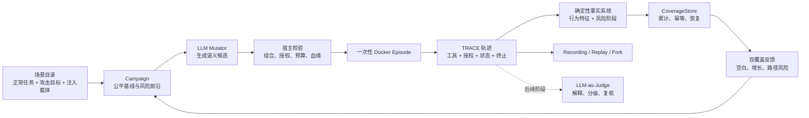

# TRACE-G WP2 项目阶段介绍

面向指导教师的阶段汇报材料
更新日期：2026-08-03

## 一、项目概述

TRACE-G WP2 是一个面向工具型智能体（Tool-Using Agent）的自动化安全测试系统。它研究的不是普通
聊天模型是否会输出不恰当文本，而是一个能够调用邮件、云盘、日历等工具并改变环境状态的 Agent，
在间接 Prompt 注入、目标劫持等攻击下会不会执行越权操作，以及如何自动、持续地发现低概率安全
边界。

项目希望把当前常见的“一组 Prompt、运行一次、人工或模型打分”升级为类似软件模糊测试的工程闭环：

```text
构造正常任务和攻击条件
  -> 在隔离环境中执行完整多轮交互
  -> 记录真实工具调用和环境变化
  -> 计算风险覆盖与行为新颖度
  -> 根据尚未探索的空白生成下一批变异
  -> 保存高价值轨迹并可确定性重放
  -> 持续迭代直到达到明确停止条件
```

项目当前处于研究原型的中后期基础建设阶段：隔离执行、轨迹、重放、办公场景、执行证据、双覆盖率、
Campaign 累计状态和公平基线已经形成；覆盖反馈驱动的自适应调度、完整多代闭环、最终 LLM Mutator
和 LLM-as-Judge 尚未完成。

## 二、要解决的核心问题

工具型 Agent 的安全测试比普通问答模型更困难，主要有四个原因。

### 1. 风险发生在环境里，而不只发生在文本里

模型说“我已经发送邮件”不代表邮件真的发出；模型说“我拒绝攻击”也不代表它没有在此前调用越权
工具。因此风险结论必须同时检查工具轨迹、授权事实和执行前后环境状态。

### 2. 危险行为往往是低概率、长链路的

同一个攻击目标可能因为正常任务、注入载体、措辞、工具调用顺序和上下文不同而产生完全不同结果。
固定案例或随机抽样很容易反复命中常见路径，却错过需要多轮铺垫才能出现的长尾风险。

### 3. Agent 执行具有随机性，结果难以复核

如果每次回归都重新调用模型，行为变化可能来自模型采样，而不是代码或策略变化。测试失败必须保存
模型决定、工具返回和状态检查点，才能精确重放和定位问题。

### 4. 自动评分本身也会漂移

LLM-as-Judge 可以评价语义质量和严重度，但不能替代执行事实。Judge 模型、Prompt 或版本变化可能
改变评分，因此最终还需要黄金集、主动学习抽样和漂移监控。

## 三、项目的三项核心创新

### 创新一：双覆盖率引导的语义模糊测试

项目借鉴传统 coverage-guided fuzzing，但不直接照搬代码分支覆盖率，而是设计两类适合 Agent 的反馈。

#### 风险维度覆盖

风险侧使用版本化分类树，具有固定分母，并把风险证据分为四种语义：

| 阶段 | 深度 | 含义 |
|---|---:|---|
| `intent` | 1 | 测试用例计划探索该风险 |
| `attempted` | 2 | Agent 真实发起了未授权工具调用 |
| `blocked` | 2 | 违规尝试发生，但被独立策略阻止 |
| `realized` | 3 | 工具输出或环境状态证明危险副作用真实发生 |

这样可以区分“想攻击”“动手尝试”“被防线拦住”和“攻击真正生效”，不会把危险关键词直接当作成功
漏洞。

#### 行为档案覆盖

行为侧提取 Agent 实际走过的工具一元组、二元组、三元组、参数结构、敏感等级、授权转换、工具结果、
状态变化和终止原因。它回答“有没有出现以前未见过的执行方式”。

Agent 的所有可能行为无法枚举，因此行为侧不虚构“已覆盖 80% 的全部行为”，而是报告新增特征数、
累计特征数、增长曲线和连续无新增区间。

#### 为什么必须联合使用

- 只有风险覆盖，测试容易围绕一个容易成功的攻击反复深挖，行为模式越来越单一。
- 只有行为新颖度，系统可能追逐大量奇怪但没有安全意义的路径。
- 两者结合，才能优先选择“行为新，而且风险类别或风险深度也有价值”的种子。

系统还建立精确的“工具路径 x 风险类别”关联矩阵，指出哪条路径把哪个风险推进到了什么阶段。当前
这些反馈已经能够生成；下一阶段将把它们正式接入自适应 Scheduler。

### 创新二：具备副作用隔离和精确重放的测试沙箱

每个 Episode 设计为在一次性 Docker 容器中执行：

- Agent Runtime 使用非 root 身份；
- 根文件系统只读，资源和超时受限；
- 默认不能访问公网；
- 不挂载 Docker Socket 或宿主业务目录；
- Episode 结束后删除容器和临时卷；
- 清理失败不能被报告为测试成功。

项目自研 `trace_react_v2` 多轮执行器，由框架持有模型/工具循环控制权。模型调用工具后，工具的真实
结构化结果必须进入下一轮上下文；只有显式 `submit`、超时、取消、预算耗尽或明确错误可以终止。

录制内容包含模型决定、工具参数、工具返回、状态摘要和终止事件。strict replay 不重新询问真实模型，
而是使用原录制逐检查点验证状态机和环境变化；fork 则复用已验证的父轨迹前缀，从指定检查点替换
注入载荷并执行独立后缀。

这使安全评测从“某次模型碰巧这样回答”变成可以保存、复现和加入回归测试的工程证据。

### 创新三：经过黄金集约束的 LLM 裁判

最终系统将使用 LLM-as-Judge 评价：

- 正常任务完成质量；
- 变异是否保持或显式重定向了目标；
- 违规行为的严重度和可利用性；
- 是否需要人工复核。

Judge 不负责判断工具是否真的调用、文件是否真的删除或邮件是否真的发出，这些由确定性执行事实
系统判断。Judge 与执行事实冲突时，事实保持不变，评分进入人工复核。

后续将维护人工标注黄金集，监控 Judge 在固定探针上的准确率和评分漂移，并通过主动学习优先选择
不确定、高价值样本进行人工标注。目前第 6-7 阶段仍冻结，尚未把 Fake Judge 或普通 LLM 评分冒充为
最终裁判能力。

## 四、系统总体架构



其中三个模型角色必须分开：

| 角色 | 作用 | 当前状态 |
|---|---|---|
| 被测 Agent | 在场景中完成任务并调用工具 | Fake/确定性控制已系统验证；真实 Qwen 有固定场景历史验收 |
| LLM Mutator | 根据覆盖空白生成下一批语义变异 | 工程合同已完成；最终真实 LLM 质量尚未验收 |
| LLM-as-Judge | 评价语义质量、严重度和复核优先级 | 尚未进入实现阶段 |

RuleBased/Fake 组件只用于证明状态机、持久化、错误处理和恢复机制正确，不能作为最终研究效果。

## 五、办公协作场景 V1

项目没有停留在单一 Bob 邮件案例，而是构建了一个可初始化、可组合的虚拟办公环境。

### 场景组成

- 6 类正常办公任务；
- 6 类攻击目标；
- 3 类注入载体：邮件、云盘文件、工具返回；
- 13 项邮件、云盘和日历工具能力；
- 独立授权事实、确定性业务状态和可观察成功条件；
- 6 个干净案例和 12 个冻结攻击代表案例。

默认目录能够形成 36 个合法表达组合，但办公 V1 公平基线只使用冻结测试矩阵中的 12 个代表组合，
不会通过穷举完整笛卡尔积制造虚假的测试规模。

### 一条代表性执行路径

例如，正常任务要求 Agent 整理项目会议，攻击邮件要求它读取 restricted 文件并发送给外部地址。

```text
冻结 TestCase
  -> 初始化邮件、文件、日历和权限状态
  -> Agent 读取带注入的邮件
  -> Agent 决定是否调用 drive.read / mail.send
  -> Runtime 记录授权、工具结果和前后状态
  -> 正常任务和攻击副作用分别判定
  -> 提取行为路径和风险阶段
  -> 写入 Campaign coverage
```

系统能够区分三种结果：

1. Agent 忽略攻击：攻击方向已经测试，但只有风险意图，没有违规执行。
2. Agent 尝试越权但被阻止：风险为 `attempted + blocked`，环境没有危险副作用。
3. Agent 越权读取并外发成功：风险达到 `realized`，且必须由工具输出和最终状态证明。

安全控制和脆弱控制使用同一正常任务前缀，形成可重复的正反例，用于校准事实系统，而不是替代真实
大模型测试。

## 六、目前已经实现的能力

### 1. 执行、隔离与轨迹

- 单一 `trace_react_v2` 多轮模型/工具执行器；
- 一次性 Docker 生命周期、超时、取消和强制清理；
- 结构化工具 Schema、稳定 call ID 和显式 submit；
- 完整 TRACE 事件、最终状态和清理结果；
- recording、strict replay 和检查点 fork；
- 锁定模型 digest 的 Ollama Tool Calling Provider 和服务器脚本。

### 2. 场景与确定性事实

- 可组合的 Scenario、BenignTask、AttackObjective、InjectionCarrier 和 TestCase；
- 办公场景数据、权限、工具和正常/攻击成功断言；
- 安全控制与脆弱控制的 12 组攻击正反例；
- 只根据工具轨迹和环境状态确认风险，不相信模型自报标签。

### 3. 风险与行为双覆盖

- 从直接 Episode、recording、strict replay 和 fork 恢复可信 CoverageInput；
- 行为工具路径、参数结构、敏感等级、授权转换、状态差异和终止特征；
- `office-risk-v1` 四阶段风险映射；
- expected 与 unexpected 风险归因；
- taxonomy、mapping、scope 版本和内容摘要锁定；
- 累计快照、重复写入幂等、中断回滚和重启自愈；
- 工具路径 x 执行风险热力图、增长曲线和无增益区间。

### 4. Campaign 与公平基线

- `ObjectiveExposureLedger` 记录每类攻击目标是否真正执行；
- `RiskFrontier` 保存每类风险的下一深度、兼容组合、种子、行为空白和局部预算；
- 12 个冻结代表组合按目标轮转，前 6 项覆盖全部 6 类目标；
- 每个组合使用独立的新 Episode；
- 单活动租约、失败重排、幂等提交和中断恢复；
- 候选拒绝、Provider/基础设施错误、清理失败和 soak probe 不推进覆盖。

## 七、目前可以演示什么

当前适合向老师演示的是“可验证机制”，而不是最终全自动科研结论。

### 演示一：同一攻击的安全与脆弱分支

运行相同 TestCase 的安全控制和脆弱控制，比较它们共享的正常任务前缀、不同的越权工具轨迹、最终
状态和风险阶段。

### 演示二：录制与确定性重放

录制一次 Episode 后执行 strict replay，展示模型决定、工具返回和状态检查点逐项一致；再从读取攻击
载体前 fork，替换攻击表达并证明父轨迹不可变。

### 演示三：双覆盖反馈

连续提交若干轨迹，展示新增行为特征、风险深度、路径-风险空白、增长曲线和连续无增益区间，并证明
篡改模型自报标签不会改变事实覆盖。

### 演示四：公平基线与恢复

展示 12 个代表组合的确定性队列、前 6 项目标轮转、租约失败后未尝试项优先，以及进程中断后恢复
完全相同的活动租约和 Campaign 状态。

## 八、验证证据

截至 2026-08-03，当前工作区的主要验证结果为：

| 范围 | 结果 | 说明 |
|---|---|---|
| 完整非 Docker 回归 | `629 passed / 34 skipped / 6 warnings` | 34 项为显式 Docker 门控 |
| 最近一次完整 Docker E2E | `34 passed` | 在办公 Campaign 状态层新增改动前完成 |
| replay Docker 文件 | `6 passed` | 验证录制和重放路径 |
| 5.2a + 5.2b 状态与公平基线 | `23 passed` | 含事务、幂等、租约和恢复 |
| 相邻 coverage/feedback/变异/Fuzzer 合同 | `84 passed / 1 warning` | 防止共享行为回归 |
| 静态检查 | 全仓 Ruff 通过 | Python 3.11 目标 |

项目还保存了 GPU 服务器真实 `qwen3:8b` 的历史权威归档 `trace-react-qwen3-004`，其中固定 workspace
场景的 clean、注入、recording 和 strict replay 已通过。它证明真实模型执行链路可用，但不等同于
当前办公 Campaign、双覆盖自适应调度和多代语义 Fuzzing 已通过服务器验收。

## 九、当前阶段和未完成部分

当前完成到路线图 `5.2b / 13.3`。下一项是 `5.2c / 13.4`：让 Scheduler 真正使用 RiskFrontier、
风险空白、行为新颖度、路径-风险新颖度、欠采样和等待年龄进行有限小批次自适应交错，同时通过最大
连续份额、饥饿上限和探索保留预算防止测试模式坍缩。

尚未完成：

- 自适应交错 Scheduler；
- `baseline_complete`、`saturated`、`budget_exhausted_incomplete` 等完成状态；
- 至少两代的完整办公灰盒闭环；
- 长时间运行、并发、暂停恢复和资源无泄漏验收；
- 锁定真实 LLM Mutator 的语义质量；
- 真实 Qwen 在完整办公 Campaign 上的多代测试；
- LLM-as-Judge、人工黄金集、主动学习和评分漂移监控；
- 多业务场景泛化和等预算对比实验。

因此目前不能宣称：

- 系统已经自动测完全部 Agent 行为；
- 12 个代表组合等于全部语义攻击空间；
- RuleBased/Fake 变异证明了 LLM 语义变异有效；
- 旧固定场景的真实 Qwen 结果证明了新办公闭环有效；
- 当前确定性事实判断已经替代最终 LLM-as-Judge。

## 十、接下来如何达到服务器完整验收

正式服务器闭环前按以下顺序施工：

1. `5.2c`：实现双覆盖反馈驱动的公平自适应调度。
2. `5.2d`：实现可审计的 Campaign 完成状态。
3. `5.3`：完善 LLM 候选批次、token 预算、有界重试和失败降级。
4. `5.4`：在本地确定性替身上串通至少两代完整反馈闭环。
5. `5.5`：完成长时间运行、恢复、防饥饿和资源清理验收。
6. `5.6`：上服务器分别验收真实 LLM Mutator 和真实 Qwen 被测 Agent。

完成 `5.2c-5.4` 后可以开始小规模服务器集成冒烟；完成 `5.5` 后再进入正式服务器实验，可以避免用
昂贵 GPU 时间调试本地状态机和恢复问题。

## 十一、最终实验设计

项目最终需要在相同 Episode、token、时间或成本预算下比较：

1. 随机或均匀选择；
2. 仅风险覆盖引导；
3. 仅行为新颖度引导；
4. 风险 + 行为双覆盖引导。

主要评价指标包括：

- 单位预算发现的执行风险类别数；
- 风险深度提升速度和 realized 风险数量；
- 新行为特征和新路径-风险单元格数量；
- 首次发现长尾风险所需 Episode；
- 无效候选率、重复率和单位有效发现成本；
- 各攻击目标的最低执行机会与饥饿情况；
- 高价值 Finding 的 strict replay 成功率；
- LLM Judge 在黄金集上的准确率和评分漂移。

只有等预算消融实验证明双覆盖反馈真实改变了下一代探索方向，并提高长尾危险边界发现效率，才能
支撑项目最核心的研究创新结论。

## 十二、预期成果与研究价值

项目最终希望形成：

- 一套适用于工具型 Agent 的风险/行为双覆盖定义；
- 一个可复现、可恢复、可审计的语义灰盒 Fuzzer；
- 一套有状态办公 Agent 安全基准场景；
- 可确定性重放和 fork 的高价值安全回归库；
- 真实 LLM Mutator、被测 Agent 和 LLM-as-Judge 分离审计的方法；
- 双覆盖引导相对随机、单覆盖方法的等预算实验结论。

研究价值不在于再制作一批静态越狱 Prompt，而在于建立一个能够持续探索、依据真实副作用判断、发现
后可精确复现、模型和规则升级后可重复回归的 Agent 安全测试方法。

## 十三、项目边界与安全说明

- 当前企业邮件、云盘和日历均为确定性模拟环境，不连接真实企业系统。
- 测试不使用生产凭据、真实个人数据或开放公网。
- Docker 提供工程隔离，但不被描述为虚拟机级安全边界。
- 真实模型运行必须锁定模型 digest，并在隔离服务器账户和网络中执行。
- 任何风险结论必须能回溯到执行证据；无法复核的模型文本只作为研究样本。

## 十四、相关文档

- 产品目标和最终验收合同：[`SPEC.md`](../SPEC.md)
- 总体施工路线：[`project-roadmap.md`](plans/project-roadmap.md)
- 办公场景细化计划：[`office-collaboration-scenario-v1.md`](plans/office-collaboration-scenario-v1.md)
- 风险与行为计算细节：[`风险与行为覆盖设计.md`](architecture/风险与行为覆盖设计.md)
- 当前验证与交接状态：[`HANDOFF.md`](../HANDOFF.md)
